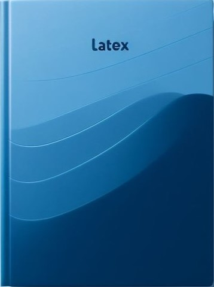
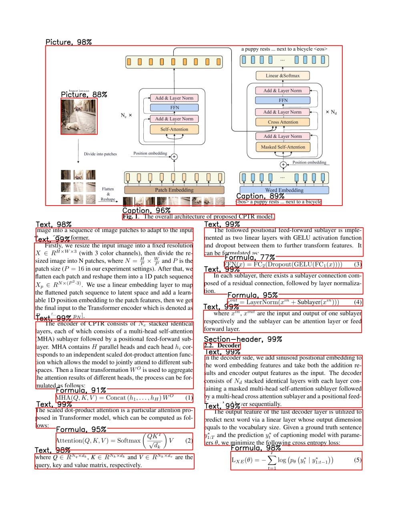
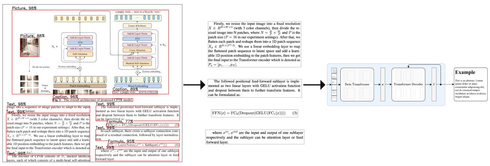

<div id="top"></div>

<!-- PROJECT LOGO -->
<br />
<div align="center">



<h3 align="center">DeepScriptum</h3>

  <p align="center">
    Convert any PDF into it's LaTeX source
    <!-- <br />
    <a href="">View Demo</a>
    ·
    <a href="">Report Bug</a>
    ·
    <a href="">Request Feature</a> -->
  </p>
</div>

<!-- TABLE OF CONTENTS -->
<details>
  <summary>Table of Contents</summary>
  <ol>
    <li>
      <a href="#current-state-and-updates">Current state and updates</a>
    </li>
    <li>
      <a href="#about-the-project">About The Project</a>
      <ul>
        <li><a href="#built-with">Built With</a></li>
      </ul>
    </li>
    <li>
      <a href="#getting-started">Getting Started</a>
      <ul>
        <li><a href="#prerequisites">Prerequisites</a></li>
        <li><a href="#installation">Installation</a></li>
      </ul>
    </li>
    <li><a href="#works-cited">Works Cited</a></li>
    <li><a href="#acknowledgments">Acknowledgments</a></li>
  </ol>
</details>

<!-- UPDATES -->
## Current state and updates

At the moment I am trying to implement two-stage solution: the first model detects independent PDF blocks, like texts, formulas, tables, etc., and the second decodes them into LaTeX. In my opinion, the biggest difficulty with this approach is decoder dataset collecting. There are some awesome ready-to-use datasets over the internet, like <a href="https://github.com/DS4SD/DocLayNet">DocLayNet</a> or <a href="https://ieee-dataport.org/open-access/scibank-large-dataset-annotated-scientific-paper-regions-document-layout-analysis">SciBank</a> to train detector on, but there is no any publicly available data for decoder part (pdf_block_image - latex), so currently I am doing my research on this.

### 15.01.2024:
Trained YOLOv8 X, L, M and Detectron2 (`faster_rcnn_R_101_FPN_3x`, `faster_rcnn_X_101_32x8d_FPN_3x`) on DocLayNet and DLN+SB




### 21.12.2023:
Collected DocLayNet, SciBank and some more data and converted it to YOLO format. The mix of DLN and SB can be the best option to train detector on


For more info please visit <a href="https://t.me/+MGclBt67OUhmNGEy">my Telegram page</a> (RU).

<!-- ABOUT THE PROJECT -->
## About The Project

The main idea of this project is to develop high accuracy LaTeX OCR for any input PDF. Such a markup gives user full control over his document, including precise copying of any block, like text, formulas, tables, etc., editing, deleting, moving them, etc. MVP includes neural worker (currently two-stage solution) for OCR performing, API to handle user requests, web interface for interaction and probably some DB's for data storing.



<p align="right">(<a href="#top">back to top</a>)</p>

### Built With

* [YOLOv8](https://ultralytics.com/yolov8)
* [Detectron2](https://github.com/facebookresearch/detectron2)

<p align="right">(<a href="#top">back to top</a>)</p>

<!-- GETTING STARTED -->

### Installation

This project is on heavy WIP, so currently there is not deploy instruction.

<p align="right">(<a href="#top">back to top</a>)</p>

<!-- Works Cited -->
## Works Cited

1. Ultralytics YOLOv8
   
   ```sh
   authors:
    - family-names: Jocher
      given-names: Glenn
      orcid: "https://orcid.org/0000-0001-5950-6979"
    - family-names: Chaurasia
      given-names: Ayush
      orcid: "https://orcid.org/0000-0002-7603-6750"
    - family-names: Qiu
      given-names: Jing
      orcid: "https://orcid.org/0000-0003-3783-7069"
   title: "YOLO by Ultralytics"
   version: 8.0.0
   date-released: 2023-1-10
   license: AGPL-3.0
   url: "https://github.com/ultralytics/ultralytics"
   ```
1. Detectron2
   
   ```sh
   @misc{wu2019detectron2,
    author =       {Yuxin Wu and Alexander Kirillov and Francisco Massa and
                    Wan-Yen Lo and Ross Girshick},
    title =        {Detectron2},
    howpublished = {\url{https://github.com/facebookresearch/detectron2}},
    year =         {2019}
    }
   ```

<!-- CONTACT -->
## Authors

<a href="https://www.linkedin.com/in/pavviaz/">Vyaznikov Pavel</a>

<p align="right">(<a href="#top">back to top</a>)</p>